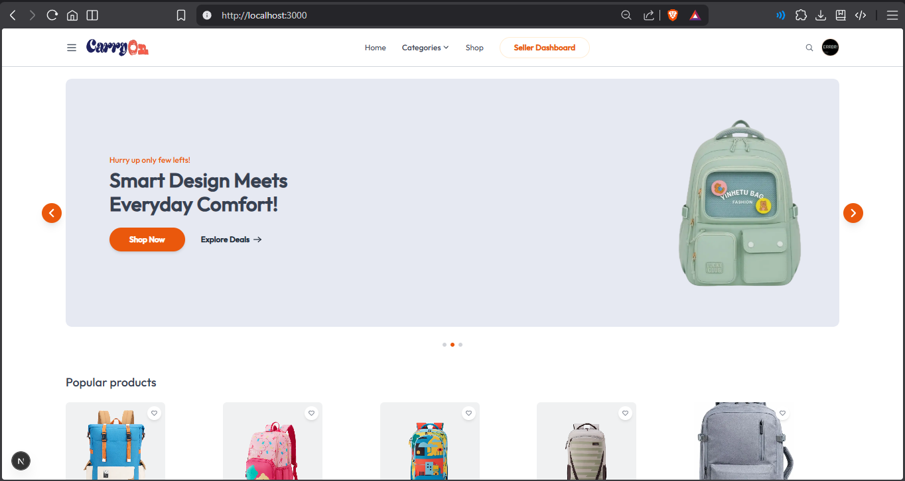
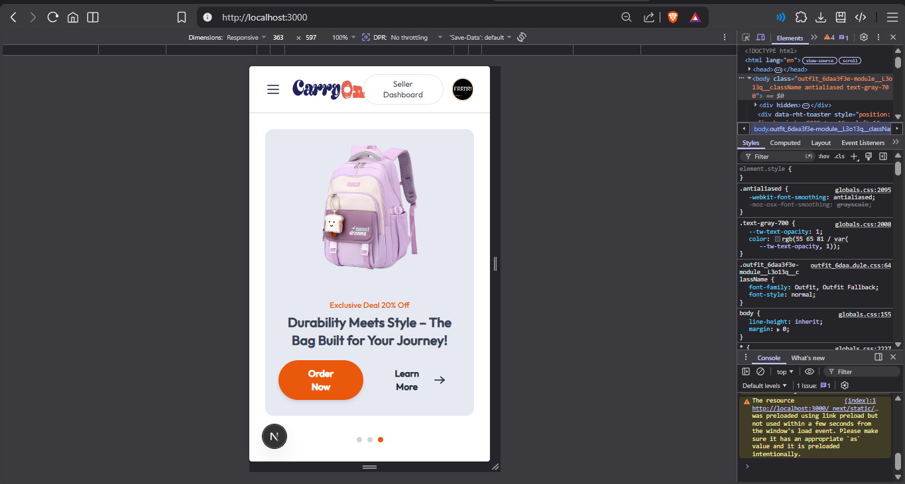
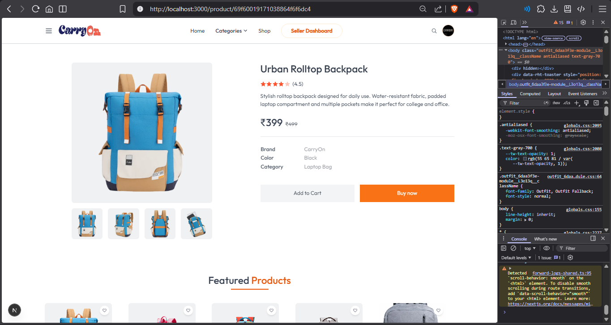
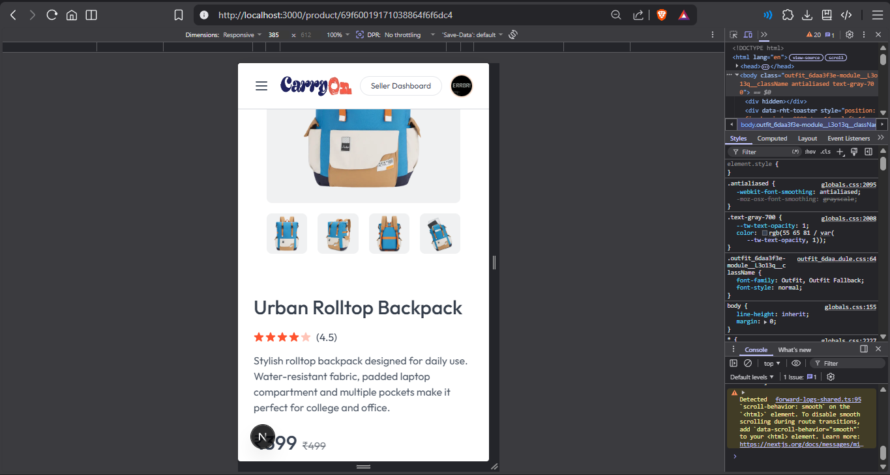
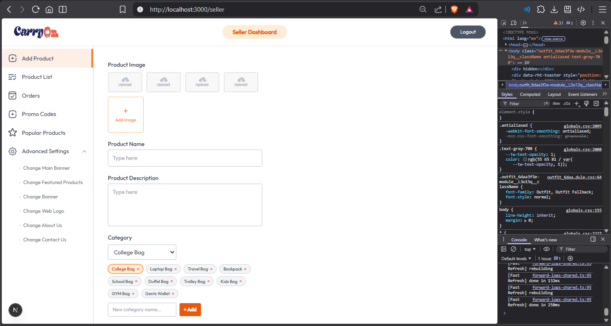
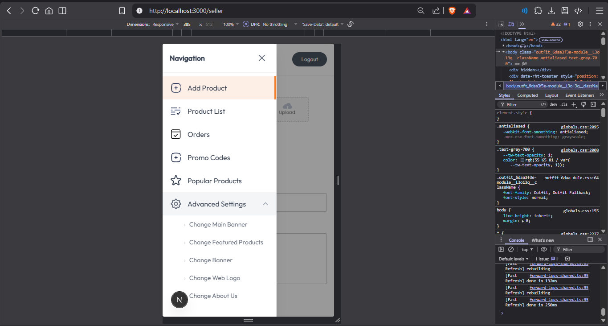

# 🛍️ CarryOn — Full-Stack E-Commerce Web Application

A modern, full-featured e-commerce platform built with **Next.js 15**, featuring a complete buyer experience alongside a powerful **Seller Dashboard** for product and order management.

---

## 🚀 Live Demo

> [https://carryon-five.vercel.app](https://carryon-five.vercel.app)

---

## 📸 Screenshots

### 🏠 Home Page
| 🖥️ Desktop | 📱 Mobile |
|---|---|
|  |  |

### 🛍️ Product Page
| 🖥️ Desktop | 📱 Mobile |
|---|---|
|  |  |

### 🏪 Seller Dashboard
| 🖥️ Desktop | 📱 Mobile |
|---|---|
|  |  |

---

## ✨ Features

### 🛒 Buyer Side
- **Home Page** — Hero slider, featured products, promotional banner, and newsletter subscription
- **Product Listing** — Browse all products with search and filter
- **Product Details** — Individual product view with add-to-cart functionality
- **Shopping Cart** — Manage items, apply promo codes, and view order summary
- **Order Placement** — Complete checkout flow with address management
- **My Orders** — Track all past and active orders
- **User Profile** — Manage account details via Clerk authentication

### 🏪 Seller Dashboard
- **Dashboard Overview** — Sales stats and quick actions
- **Product Management** — Add, edit, and delete products with Cloudinary image uploads
- **Product List** — View and manage all listed products
- **Order Management** — View and process customer orders
- **Promo Code Management** — Create and manage discount codes
- **Content Management** — Update homepage slider, featured products, banner, logo, and about/contact pages
- **Site Settings** — Configure site-wide settings

### ⚙️ Technical Highlights
- **Background Jobs** with **Inngest** — Event-driven workflows (e.g., order confirmation emails)
- **Authentication** with **Clerk** — Secure sign-in/sign-up with protected routes
- **MongoDB** via **Mongoose** — Flexible NoSQL data modeling
- **Cloudinary** — Cloud-based image storage for product images
- **API Routes** — RESTful endpoints built with Next.js App Router
- **Promo Code System** — Percentage-based discounts with expiry and usage limits
- **Responsive Design** — Fully mobile-friendly with Tailwind CSS

---

## 🛠️ Tech Stack

| Technology | Purpose |
|---|---|
| [Next.js 15](https://nextjs.org/) | React Framework (App Router) |
| [React 19](https://react.dev/) | UI Library |
| [Tailwind CSS](https://tailwindcss.com/) | Styling |
| [Clerk](https://clerk.com/) | Authentication & User Management |
| [MongoDB + Mongoose](https://mongoosejs.com/) | Database & ODM |
| [Cloudinary](https://cloudinary.com/) | Image Storage & Optimization |
| [Inngest](https://www.inngest.com/) | Background Jobs & Event Workflows |
| [Axios](https://axios-http.com/) | HTTP Client |
| [React Hot Toast](https://react-hot-toast.com/) | Notifications |
| [Vercel](https://vercel.com/) | Deployment |

---

## 📁 Project Structure

```
CarryOn/
├── app/
│   ├── page.jsx              # Home page
│   ├── layout.js             # Root layout
│   ├── all-products/         # Product listing page
│   ├── product/              # Product detail page
│   ├── cart/                 # Shopping cart
│   ├── my-orders/            # Order history
│   ├── add-address/          # Address management
│   ├── order-placed/         # Order confirmation
│   ├── user-profile/         # User profile page
│   ├── seller/               # Seller dashboard (protected)
│   │   ├── page.jsx          # Add product
│   │   ├── product-list/     # Manage products
│   │   ├── orders/           # Manage orders
│   │   ├── promo/            # Promo code management
│   │   ├── slider/           # Homepage slider settings
│   │   ├── featured/         # Featured products settings
│   │   ├── banner/           # Banner settings
│   │   ├── popular/          # Popular products settings
│   │   ├── logo/             # Site logo settings
│   │   ├── about/            # About page settings
│   │   ├── contact/          # Contact page settings
│   │   └── settings/         # Site settings
│   └── api/                  # Next.js API Routes
│       ├── cart/
│       ├── order/
│       ├── product/
│       ├── promo/
│       ├── settings/
│       ├── user/
│       └── inngest/          # Inngest event handler
├── components/               # Reusable UI components
│   ├── Navbar.jsx
│   ├── Footer.jsx
│   ├── HeaderSlider.jsx
│   ├── HomeProducts.jsx
│   ├── FeaturedProduct.jsx
│   ├── Banner.jsx
│   ├── NewsLetter.jsx
│   ├── ProductCard.jsx
│   ├── OrderSummary.jsx
│   └── seller/               # Seller-specific components
├── models/                   # Mongoose schemas
│   ├── User.js
│   ├── Product.js
│   ├── Order.js
│   ├── Address.js
│   ├── PromoCode.js
│   └── SiteSettings.js
├── context/
│   └── AppContext.jsx         # Global app state
├── config/                   # DB & service config
└── lib/                      # Utility functions
```

---

## ⚡ Getting Started

### Prerequisites

- **Node.js** v18+
- **MongoDB** database (local or [MongoDB Atlas](https://www.mongodb.com/atlas))
- **Clerk** account — [clerk.com](https://clerk.com)
- **Cloudinary** account — [cloudinary.com](https://cloudinary.com)
- **Inngest** account (optional for background jobs) — [inngest.com](https://www.inngest.com)


## 🗃️ Database Models

| Model | Description |
|---|---|
| `User` | Stores user data synced from Clerk, cart items |
| `Product` | Product details — name, price, category, images, stock |
| `Order` | Customer orders with items, address, and payment status |
| `Address` | Saved delivery addresses per user |
| `PromoCode` | Discount codes with percentage, expiry, and usage tracking |
| `SiteSettings` | CMS data — slider images, banners, featured content |

---

## 🔐 Authentication & Authorization

- Authentication is handled by **Clerk** with pre-built sign-in/sign-up modals.
- Protected routes automatically redirect unauthenticated users to the sign-in flow.
- The **Seller Dashboard** is restricted to authorized seller accounts only.

---

## 📦 Deployment

This project is deployed on **Vercel**.

---

> Built with ❤️ using Next.js, MongoDB, Clerk, and Cloudinary.
